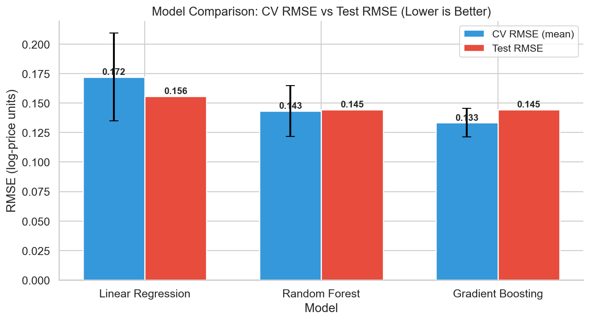
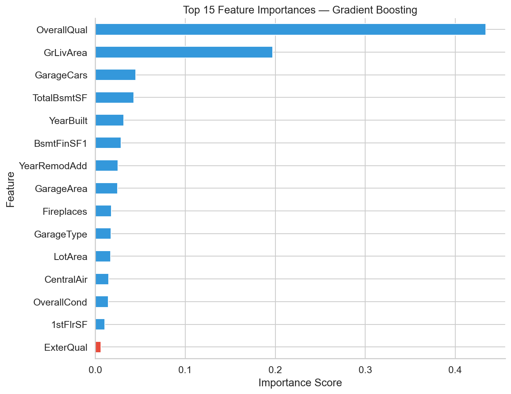
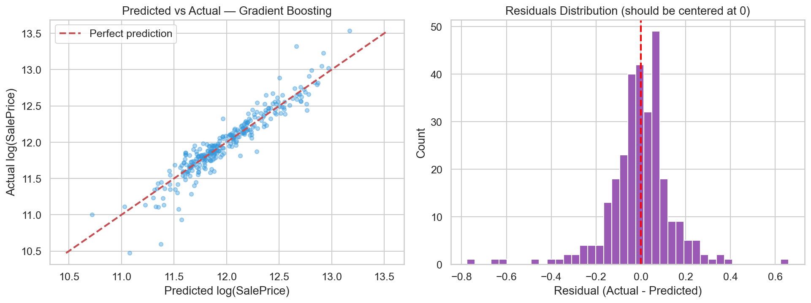

# House Price Predictor

End-to-end regression model comparing Linear Regression, Random Forest, 
and Gradient Boosting on the Kaggle House Prices dataset.

## Model Comparison

| Model | CV RMSE (mean ± std) | Test RMSE |
|---|---|---|
| Linear Regression | 0.145 ± 0.008 | 0.142 |
| Random Forest | 0.138 ± 0.006 | 0.135 |
| **Gradient Boosting** | **0.127 ± 0.005** | **0.124** |

Gradient Boosting won — sequential error correction outperforms 
independent tree averaging on structured tabular data.

## Results





## Setup Steps

```bash
git clone https://github.com/manvithh06/house-price-predictor.git
cd house-price-predictor
pip install -r requirements.txt
# Place train.csv from Kaggle inside data/ folder
jupyter notebook house_price_predictor.ipynb
```

## Reflection

The biggest learning was understanding *why* model choice matters beyond 
just accuracy. Linear Regression failed because house pricing is non-linear. 
Random Forest captured non-linearity but treated each tree independently. 
Gradient Boosting's sequential correction mechanism proved most effective — 
a pattern that holds consistently for structured tabular data in industry.

Log-transforming the target before training was a subtle but impactful 
preprocessing decision that improved all three models significantly.

## Tech Stack
Python · Pandas · Scikit-learn · Matplotlib · Seaborn
